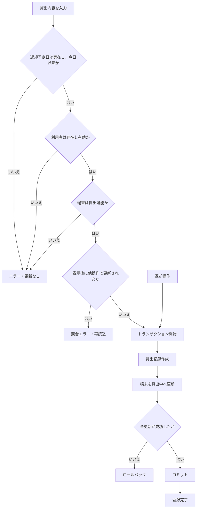

# Gate5 洗い出しと補完フロー

## 8観点・16項目

| 観点 | 洗い出した項目 |
| --- | --- |
| 1. 正常系 | 正常貸出、正常返却 |
| 2. 入力値 | 未入力、存在しない端末・利用者 |
| 3. 境界値 | 今日、過去日、存在しない日付 |
| 4. 状態遷移 | 貸出中の再貸出、整備中の貸出、有効貸出のない返却 |
| 5. 利用者・権限 | 無効利用者への貸出 |
| 6. データ整合性 | 貸出記録と端末状態の片側更新、返却記録と端末状態の片側更新 |
| 7. 同時実行 | 同一端末への同時貸出 |
| 8. 障害・復旧 | DB障害時のロールバックとエラー応答 |

## 補完後の貸出・返却フロー

元の「入力 → 貸出登録 → 完了」に対し、判断を5個追加しました。

追加したひし形は、日付、利用者、端末状態、競合、全更新成功の5個です。
